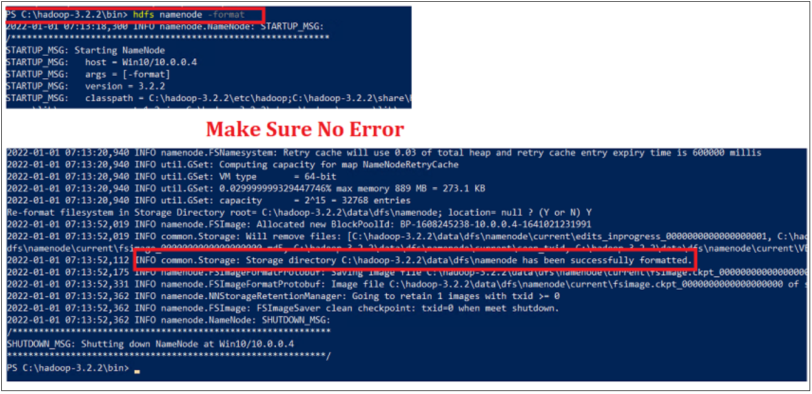

# Install and Configure Hadoop on Windows 10

## Prerequisites

-   ***Java 8 runtime environment (JRE)***

    <https://www.java.com/en/download/windows_offline.jsp>

-   ***Java 8 development Kit (JDK)***

    <https://www.oracle.com/java/technologies/downloads/>

-   ***Downloaded Hadoop binaries***

    <https://www.apache.org/dyn/closer.cgi/hadoop/common/hadoop-3.2.2/hadoop-3.2.2.tar.gz>

## Install and Configure Prerequisites

1.  Install Java 8 runtime environment (JRE)

    {width="404"}

2.  Java 8 development Kit (JDK)

    {width="605"}

3.  Downloaded Hadoop binaries and unzip

    ***Note***: Install '7Zip' to Extract Hadoop Binaries (<https://www.7-zip.org/download.html>)

    {width="562"}

4.  Install JRE

    {width="400"}

5.  Install Java DSK

    {width="402"}

    {width="402"}

    {width="300"}

6.  Setting up environment variables

    -   (Right-click \> properties on My Computer icon) and click on the "Advanced system settings" link.

    -   Set Environment Variable

        -   Click 'Advanced System Settings'

            {width="447"}

        -   Click 'Advanced tab'

        -   Click 'Environment Variables'

        -   Go to 'System Properties' section

            {width="447"}

        -   In the 'Environment Variables' dialog, press the 'New' button to add a new variable.

        -   There are two variables to define

            -   ***JAVA_HOME***: JDK installation folder path

                {width="392"}

            -   ***HADOOP_HOME***: Hadoop installation folder path

                {width="388"}

    -   Edit the 'PATH' variable to add the '***JAVA_HOME*** and'***HADOOP_HOME***' binaries paths.

        {width="370"}

    -   {width="300"}

## Configure Hadoop

1.  Extract the Hadoop Files to C:Drive

    {width="330"}

2.  Add the Hadoop native IO libraries

    -   Which can be found in the following GitHub repository <https://github.com/cdarlint/winutils>

    -   Note : Since we are installing `Hadoop 3.2.2`, we should download the files located in `hadoop-3.2.2/bin/`

    -   Copy them into the `'C:\hadoop-3.2.2\bin'` directory

        {width="490"}

        {width="489"}

3.  Check for the Hadoop Installation

    1.  Open the `Power Shell` and run command '`hadoop -version`'

    2.  If we get below the error ***JAVA_HOME*** is incorrectly set' means we should use the `windows 8.3` path instead.

        -   Changes on the `Environment Varibales`
            -   Use '`Progra~1'` instead of'`Program Files'`

            -   Use '`Progra~2'` instead of'`Program Files(x86)'`

        {width="473"}

## Configuring Hadoop cluster

1.  There are four files we should alter to configure Hadoop cluster:

    -   %HADOOP_HOME%\\etc\\hadoop\\hdfs-site.xml
    -   %HADOOP_HOME%\\etc\\hadoop\\core-site.xml
    -   %HADOOP_HOME%\\etc\\hadoop\\mapred-site.xml
    -   %HADOOP_HOME%\\etc\\hadoop\\yarn-site.xml

2.  HDFS site configuration

    1.  Create a directory to store all master node (name node) data and another one to store data (data node).

    2.  Create the following directories:

        -   C:\\hadoop-3.2.2\\data\\dfs\\namenode
        -   C:\\hadoop-3.2.2\\data\\dfs\\datanode

        {width="426"}

    3.  Open '`hdfs-site.xml`' from location '`C:\hadoop-3.2.2\etc\hadoop`'

        Add the following properties within the \<configuration\>\</configuration\> element

        ``` xml
        <property>
          <name>dfs.replication</name>
          <value>1</value>
        </property>
        <property>
          <name>dfs.namenode.name.dir</name>
          <value>file:///C:/hadoop-3.2.2/data/dfs/namenode</value>
        </property>
        <property>
          <name>dfs.datanode.data.dir</name>
          <value>file:///C:/hadoop-3.2.2/data/dfs/datanode</value>
        </property>
        ```

        {width="420"}

        **Note**: that we have set the replication factor to 1 since we are creating a single node cluster.

    4.  Core site configuration for name node URL

        -   Open 'core-site.xml' add following XML code into the \<configuration\> \</configuration\> element

            ``` xml
            <property>
               <name>fs.default.name</name>
               <value>hdfs://localhost:9820</value>
            </property>
            ```

    5.  Map Reduce site configuration

        -   Open 'mapred-site.xml'

        -   Add the following XML code into the \<configuration\> \</configuration\> element

            ``` xml
             <property>
              <name>mapreduce.framework.name</name>
                <value>yarn</value>
                <description>MapReduce framework name</description>
             </property>
            ```

    6.  Yarn `site configuration`

        -   Open '`yarn-site.xml`'

        -   Add the following `XML` code into the `<configuration> </configuration>` element

            ``` xml
            <property>
               <name>yarn.nodemanager.aux-services</name>
                <value>mapreduce_shuffle</value>
               <description>Yarn Node Manager Aux Service</description>
            </property>
            ```

    7.  Formatting `Name node`

        -   Open the powershell run the command '`hdfs namenode -format`'

            {width="443"}

    8.  Starting `Hadoop services`

        1.  Open the Powershell and Navigate to '`C:\hadoop-3.2.2\sbin`'

        2.  Run the command '`.\start-dfs.cmd`'

            **Note** : Two command prompt windows will open (one for the name node and one for the data node)

            {width="461"}

    9.  Start the Hadoop '`Yarn service'`

        -   Open the `Powershell` and Navigate to '`C:\hadoop-3.2.2\sbin`'

        -   Run the command '`./start-yarn.cmd`'

            **Note** : Two command prompt windows will open (one for the resource manager and one for the node manager)

            {width="462"}

    10. Make sure that all services started successfully

        -   Open the `Powershell` and Navigate to '`C:\hadoop-3.2.2\sbin`'

        -   Run the comand '`jps`'

        -   It should display the following services

            -   14560 DataNode

            -   4960 ResourceManager

            -   5936 NameNode

            -   768 NodeManager

            -   14636 Jps

            {width="438"}

## Check the Hadoop Web UI

1.  There are three web user interfaces to be used:
    1.  Name node web page

        <http://localhost:9870/dfshealth.html>

        {width="450"}

    2.  Data node web page

        <http://localhost:9864/datanode.html>

        {width="454"}

    3.  Yarn web page

        <http://localhost:8088/cluster>

        {width="456"}
